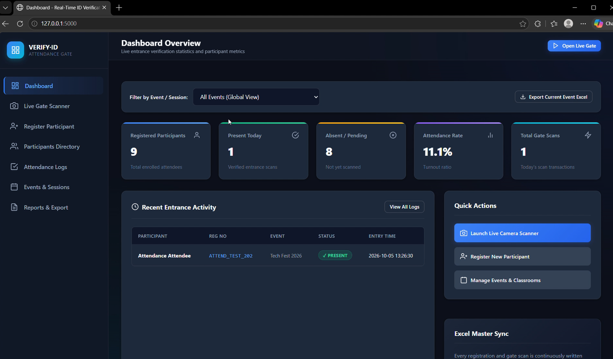

# Real-Time ID Verification & Attendance System 🚀

A production-ready, high-performance automated **Real-Time ID Verification & Attendance Management System** built with **Python (Flask)**, **OpenCV Computer Vision**, **MySQL Relational Database**, **openpyxl (Excel Synchronization)**, and **QR Code Cryptographic ID generation**.

Designed for colleges, conferences, workshops, seminars, hackathons, exams, and controlled-entry security gates.

---

## 📸 System Dashboard Preview



---

## 🎥 Live Video Demo

[](https://youtu.be/ywrEMcgfQSc)

📺 **Watch the complete workflow & real-time scanning demo on YouTube:** [https://youtu.be/ywrEMcgfQSc](https://youtu.be/ywrEMcgfQSc)

---

## 🌟 Key Highlights & Features

1. **Continuous Real-Time QR Scanning**:
   - High-throughput OpenCV camera feed with automated QR detection and polygon bounding-box tracking.
   - Real-time HUD (Heads-Up Display) with audio chimes and visual color coding:
     - 🟢 **Green**: Verified Present (Entry Marked)
     - 🟡 **Yellow**: Already Verified (Duplicate Scan Acknowledged)
     - 🔵 **Blue**: Exit Recorded
     - 🔴 **Red**: Unregistered / Invalid QR

2. **Zero Duplicate Scans & Cooldown Control**:
   - In-memory frame-level cooldown mechanism (configurable, default 8s) prevents camera frame spam from triggering multiple database writes.
   - Database constraint verification ensuring only 1 entry record per participant per event/day.

3. **Production Database & Resilient Architecture**:
   - Native **MySQL** relational schema with foreign keys, cascading deletes, indexes, and full parameterized query safety against SQL injections.
   - Automatic zero-config **SQLite fallback** when running offline or during testing.

4. **Continuous Excel Mirroring (`openpyxl`)**:
   - Every participant registration and attendance scan automatically updates `data/Master_Attendance_Record.xlsx`.
   - On-demand custom Excel (`.xlsx`) and CSV reports with stylized headers, status badges, and timestamp logs.

5. **Multi-Event & Multi-Session Support**:
   - Supports classrooms, multi-day seminars, conferences, hackathons, and corporate workshops.
   - Seamless dynamic event switching directly from the live gate scanner.

6. **Interactive Printable ID Badges**:
   - Generates standardized, high-error-correction QR codes stored in `data/qr_codes/`.
   - Built-in printable ID card view with direct PNG downloads.

---

## 🏗️ System Architecture & Workflow

```text
                                 REGISTRATION
                                      │
                         ┌────────────┴────────────┐
                         ▼                         ▼
                  [ MySQL / DB ]         [ QR Code Generator ]
                         │                         │
                         ▼                         ▼
            [ Master Excel Record ]      [ Printable ID Pass ]
                                                   │
                                                   ▼
                                         Presented at Entrance
                                                   │
                                                   ▼
                                           ┌───────────────┐
                                           │ OpenCV Camera │
                                           └───────┬───────┘
                                                   │
                                                   ▼
                                            QR Detection
                                                   │
                                                   ▼
                                            QR Decoding
                                                   │
                                                   ▼
                                         Database Verification
                                                   │
                           ┌───────────────────────┴───────────────────────┐
                           ▼                                               ▼
                    [ Participant Found ]                         [ Not Registered ]
                           │                                               │
               ┌───────────┴───────────┐                                   ▼
               ▼                       ▼                             ✗ Access Denied
       [ First Entry ]        [ Already Scanned ]
               │                       │
               ▼                       ▼
      ✓ Attendance Marked    ✓ Duplicate Prevented
      ✓ Excel Synced         ✓ Last Entry Displayed
      ✓ Green HUD            ✓ Amber HUD
```

---

## 🛠️ Technology Stack

- **Backend**: Python 3.11+, Flask
- **Computer Vision**: OpenCV (`cv2.VideoCapture`, `cv2.QRCodeDetector`)
- **Database**: MySQL 5.7+ / 8.0+ (with `mysql-connector-python` & `PyMySQL`)
- **QR Generation**: `qrcode[pil]`, `Pillow`
- **Spreadsheet Engine**: `openpyxl`
- **Frontend**: Modern Vanilla HTML5, CSS3 Glassmorphism, JavaScript, Web Audio API

---

## 📂 Project Structure

```text
Real-Time-ID-Verification-Attendance-System/
│
├── app.py                      # Application Factory and Server Entry Point
├── config.py                   # Environment & Configuration Manager
├── requirements.txt            # Python Dependencies
├── README.md                   # System Documentation
├── .env.example                # Configuration Blueprint
├── .env                        # Local Environment Settings
│
├── database/
│   ├── schema.sql              # MySQL DDL Schema Definition
│   ├── db.py                   # Dual-Engine MySQL/SQLite Database Adapter
│   └── seed.py                 # Initial Demo Data Population Script
│
├── models/
│   ├── participant.py          # Participant Model & QR Generation Hook
│   ├── attendance.py           # Attendance Model & Filtering Queries
│   └── event.py                # Event & Classroom Session Model
│
├── services/
│   ├── qr_generator.py         # Standardized High-Contrast QR Generator
│   ├── qr_scanner.py           # OpenCV Video Capture & HUD Overlay Engine
│   ├── verification_service.py # QR Payload Parsing & Integrity Checks
│   ├── attendance_service.py   # Business Rules & Cooldown Engine
│   └── excel_service.py        # Master Excel Mirror & Report Exporter
│
├── routes/
│   ├── dashboard.py            # Overview & Metrics Routes
│   ├── scanner.py              # Live Gate Streaming & Scan APIs
│   ├── participants.py         # Registration & Directory Routes
│   ├── attendance.py           # Logs & Filtering Routes
│   ├── events.py               # Event Management Routes
│   └── reports.py              # Excel & CSV Exporter Routes
│
├── templates/
│   ├── base.html               # Master Layout & Navigation Sidebar
│   ├── dashboard.html          # Admin Dashboard & Statistics
│   ├── scanner.html            # Live Video Gate & Detection HUD
│   ├── register.html           # Participant Enrollment & Instant Pass
│   ├── participants.html       # Participant Table & QR Modals
│   ├── attendance.html         # Gate Access Logs & Manual Entry
│   ├── events.html             # Event / Session Manager
│   └── reports.html            # Report Generator & Backups
│
├── static/
│   ├── css/
│   │   └── style.css           # Modern Dark-Tech Custom Stylesheet
│   └── js/
│       ├── app.js              # Global Utilities & Modal Handlers
│       └── scanner.js          # Live Camera HUD Polling & Audio Chimes
│
├── data/
│   ├── qr_codes/               # Stored PNG Pass Images
│   └── exports/                # Generated Downloadable Reports
│
├── tests/
│   ├── test_registration.py    # Participant Validation Tests
│   ├── test_qr.py              # QR Generation & OpenCV Decoding Tests
│   ├── test_verification.py    # Payload Integrity & DB Lookup Tests
│   └── test_attendance.py      # Duplicate Prevention & Cooldown Tests
│
└── logs/
    └── app.log                 # Production Runtime Logs
```

---

## 🚀 Installation & Quick Start

### 1. Clone & Set Up Environment

```bash
# Clone the repository
git clone https://github.com/nitin-singh202/Real-Time-ID-Verification-Attendance-System.git
cd Real-Time-ID-Verification-Attendance-System

# Create and activate a virtual environment
python -m venv venv

# Windows
venv\Scripts\activate

# Linux / macOS
source venv/bin/activate

# Install all dependencies
pip install -r requirements.txt
```

### 2. Configure Environment (`.env`)

Copy `.env.example` to `.env`:

```bash
cp .env.example .env
```

Edit `.env` to configure your MySQL database and camera index:

```ini
FLASK_APP=app.py
FLASK_ENV=development
SECRET_KEY=production-secret-key-xyz

# Database Settings
DB_TYPE=mysql
DB_HOST=localhost
DB_PORT=3306
DB_NAME=attendance_system
DB_USER=root
DB_PASSWORD=your_password

# Camera Settings
CAMERA_INDEX=0
CAMERA_WIDTH=1280
CAMERA_HEIGHT=720
CAMERA_FPS=30

# Scanner Rules
QR_SCAN_COOLDOWN_SECONDS=8
ALLOW_EXIT_SCAN=true
EXCEL_AUTO_SYNC=true
```

> **Note**: If MySQL is not running on your machine, the system will automatically fall back to the built-in SQLite database at `data/attendance.db` without failing or crashing.

### 3. Initialize MySQL Database (Optional if using MySQL)

Import the SQL schema via MySQL CLI or Workbench:

```bash
mysql -u root -p < database/schema.sql
```

### 4. Seed Initial Demo Data (Optional)

Run the seed script to create sample events, participants, and generated QR codes:

```bash
python database/seed.py
```

### 5. Launch the Server

```bash
python app.py
```

Open your browser and navigate to:
👉 **`http://localhost:5000`**

---

## 🧪 Acceptance Test & Verification Flow

To verify the complete end-to-end functionality:

1. **Step 1: Register a Participant**
   - Open **`http://localhost:5000/register`**.
   - Enter:
     - Name: `Nitin Kumar`
     - Registration Number: `TEST001`
     - Event: `Tech Fest 2026`
   - Click **Register & Generate QR Code**.
   - Verify that the QR ID Pass Card is generated on screen with download and print options.

2. **Step 2: Live Gate Verification**
   - Navigate to **`http://localhost:5000/scanner`**.
   - Point the generated QR pass (printed or on a phone screen) at the webcam.
   - The scanner detects the QR code, draws a green bounding box on the video stream, sounds an entrance chime, and updates the HUD:
     ```text
     ✓ VERIFIED PRESENT
     Name: Nitin Kumar
     Registration No: TEST001
     Event: Tech Fest 2026
     Entry Time: 09:32:15
     ```

3. **Step 3: Duplicate Scan Prevention**
   - Hold the same QR code in front of the camera.
   - The system recognizes the participant is already present:
     ```text
     ✓ ALREADY SCANNED
     Already marked present at 09:32:15.
     ```
   - **No duplicate database records are created.**

4. **Step 4: Check Attendance Logs & Excel Sync**
   - Navigate to **`http://localhost:5000/attendance`** to view the entry record.
   - Check `data/Master_Attendance_Record.xlsx` to confirm the attendance status and entry timestamp were automatically synchronized.

---

## ⚡ Running Automated Tests

Run the full pytest test suite:

```bash
pytest
```

---

## 🔒 Security & Best Practices

- **Parameterized Queries**: All SQL queries utilize parameter substitution (`%s` / `?`) to eliminate SQL injection vulnerabilities.
- **Payload Integrity**: QR codes encapsulate structured JSON payloads containing both participant UUID and registration numbers.
- **Fail-Safe Camera Streaming**: If the webcam is disconnected or busy, the server renders a structured offline HUD rather than throwing unhandled exceptions.
- **Graceful File Handling**: Automatic directory generation for exports and QR code storage.
